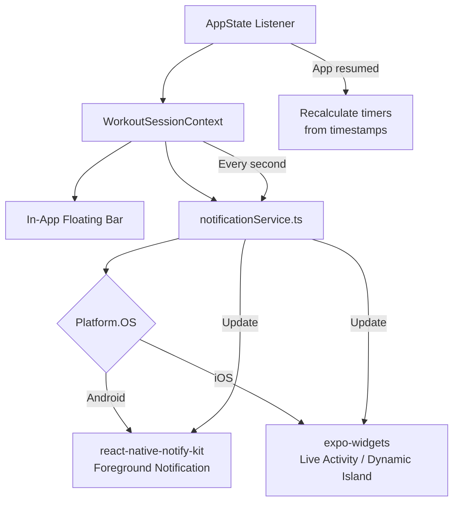

# Active Session "Island Bar" — In-App + OS-Level Persistence

When a workout session is active and the user leaves the app, they should see a persistent indicator showing the workout name, elapsed timer, and rest countdown — like Apple's Dynamic Island for music or Uber.

This feature has **two layers**: improving the existing in-app floating bar and adding **OS-level persistence** so it works outside the app.

## User Review Required

> [!IMPORTANT]
> **This is an Android-only project right now** (no iOS target in `app.json`). The iOS Live Activity / Dynamic Island feature (`expo-widgets`) **only works on iOS 16.1+**. We should still build the architecture to support it, but **it won't be testable until you add an iOS target**.

> [!WARNING]
> **OS-level features require Development Builds.** Both `expo-widgets` (iOS) and `react-native-notify-kit` (Android) need native code — they **cannot run in Expo Go**. You'll need to use `npx expo run:android` (which you already do) and eventually `npx expo run:ios`.

> [!CAUTION]
> **Android 14+ (API 34)** requires declaring a `foregroundServiceType` for foreground services. The config plugin for `react-native-notify-kit` handles this, but be aware it may require a specific target SDK version.

## Open Questions

1. **Which platform do you want to prioritize first?** Since your project is Android-focused, I'd recommend starting with the Android foreground notification and deferring iOS Live Activities until you add an iOS target. Agree?

2. **Rest timer notification behavior**: When the rest timer finishes while the app is backgrounded, should the notification:
   - Just vibrate/play sound (current behavior via `expo-av`)?
   - Also update the notification text to say "REST COMPLETE — Time for next set"?
   - Both?

3. **Notification actions**: Should the Android foreground notification have tap-to-return-to-app functionality? (e.g., tapping the notification opens the active session screen)

---

## Proposed Changes

This is a **4-milestone** implementation. I recommend tackling them sequentially.

---

### Milestone 1: Improve the In-App Floating Bar

The existing [ActiveWorkoutFloatingBar.tsx](file:///c:/Users/ronis/forge/components/ActiveWorkoutFloatingBar.tsx) works but can be enhanced.

#### [MODIFY] [ActiveWorkoutFloatingBar.tsx](file:///c:/Users/ronis/forge/components/ActiveWorkoutFloatingBar.tsx)

**Current issues / improvements:**
- Add a **pulsing glow animation** when the rest timer is active (makes it more "alive")
- Add a **progress indicator** for the rest timer (circular or linear)
- Add a **haptic tap feedback** when pressing to expand
- Improve the **Dynamic Island-style shape** — currently it's a plain rounded rectangle. We can make it more capsule-shaped with tighter radius and a smoother entrance animation (SlideInDown instead of FadeInUp)
- Show the **current exercise name** (not just the session name) so the user knows what they're resting between

#### [MODIFY] [WorkoutSessionContext.tsx](file:///c:/Users/ronis/forge/context/WorkoutSessionContext.tsx)

- Add a `currentExerciseName` field to the context (tracks the last exercise the user completed a set for)
- This feeds both the in-app bar and the OS-level notification

---

### Milestone 2: Android Foreground Notification (OS-Level)

This is the core of "seeing the workout when you leave the app" on Android.

#### [NEW] Install `react-native-notify-kit`

```bash
npm install react-native-notify-kit
```

#### [MODIFY] [app.json](file:///c:/Users/ronis/forge/app.json)

Add the config plugin:
```json
"plugins": [
  "expo-sqlite",
  "expo-router",
  "expo-status-bar",
  ["react-native-notify-kit", { "androidForegroundService": true }]
]
```

#### [NEW] [lib/notificationService.ts](file:///c:/Users/ronis/forge/lib/notificationService.ts)

A service module that abstracts the Android foreground notification:

- `startWorkoutNotification(sessionName, elapsedTime)` — Creates an ongoing, non-dismissible notification
- `updateWorkoutNotification(elapsedTime, restTimeLeft?, currentExercise?)` — Updates the notification body every second
- `stopWorkoutNotification()` — Removes the foreground notification when session ends
- Handles channel creation (`workout-timer` channel with HIGH importance)

#### [MODIFY] [WorkoutSessionContext.tsx](file:///c:/Users/ronis/forge/context/WorkoutSessionContext.tsx)

- Call `startWorkoutNotification()` when `startSession()` is called
- Call `updateWorkoutNotification()` inside the timer `useEffect` (every second)
- Call `stopWorkoutNotification()` when `finishSession()` or `cancelSession()` is called
- Use **timestamp-based elapsed time** (`Date.now() - startTime`) instead of `setInterval` counter for accuracy when backgrounded

#### [MODIFY] [index.ts](file:///c:/Users/ronis/forge/index.ts) (entry file)

- Register the foreground service handler at the top level (before app renders) so it can run even if the app is killed

---

### Milestone 3: Background Timer Accuracy

**Why this matters:** Your current timer uses `setInterval` which gets throttled/killed when the app is backgrounded on Android. The notification timer will drift or freeze.

#### [MODIFY] [WorkoutSessionContext.tsx](file:///c:/Users/ronis/forge/context/WorkoutSessionContext.tsx)

- **Session timer**: Switch from `setInterval` counting to `Date.now() - startTime` calculation. Use `useEffect` + `AppState` listener to recalculate elapsed time when app returns to foreground
- **Rest timer**: Store `restStartTime` and `restDuration`, calculate `restTimeLeft = restDuration - (Date.now() - restStartTime)` on each tick and on app resume
- Add `AppState` change listener: when app comes back to foreground, immediately recalculate both timers from stored timestamps

---

### Milestone 4: iOS Live Activity (Future — When iOS Target Is Added)

> [!NOTE]
> This milestone is documented for planning purposes. It should only be implemented when you add an iOS target to your project.

#### [NEW] Install `expo-widgets`

```bash
npx expo install expo-widgets
```

#### [MODIFY] [app.json](file:///c:/Users/ronis/forge/app.json)

Add the expo-widgets config plugin with Live Activity configuration:
```json
["expo-widgets", {
  "widgets": [],
  "enableLiveActivities": true,
  "bundleIdentifier": "com.roni.dev.forge.ExpoWidgetsTarget",
  "groupIdentifier": "group.com.roni.dev.forge"
}]
```

#### [NEW] Widget component file

A React component defining the Live Activity UI (workout name, elapsed timer, rest timer pill) — rendered natively via SwiftUI by expo-widgets.

#### [MODIFY] [lib/notificationService.ts](file:///c:/Users/ronis/forge/lib/notificationService.ts)

Add platform-conditional logic:
- On iOS: Start/update/stop Live Activity
- On Android: Start/update/stop foreground notification (already built in M2)

---

## Verification Plan

### Automated Tests
- No automated tests needed for this feature (UI + native notification behavior)

### Manual Verification

**Milestone 1 (In-App Bar):**
- Start a workout → collapse it → verify the floating bar appears on all tab screens
- Complete a set → verify rest timer shows on the floating bar with animation
- Tap the bar → verify it navigates back to active session

**Milestone 2 (Android Notification):**
- Start a workout → press Home → verify a persistent notification appears in the notification shade
- Verify the notification shows workout name and elapsed time
- Verify the notification updates every second
- Complete a set → verify rest timer appears in the notification
- Finish/cancel workout → verify notification is dismissed
- Tap notification → verify it returns to the app's active session

**Milestone 3 (Timer Accuracy):**
- Start a workout → background the app for 2+ minutes → return → verify the timer shows the correct elapsed time (not frozen or behind)
- Start rest timer → background app → wait for rest to complete → verify vibration/sound fires correctly

---

## Architecture Overview


